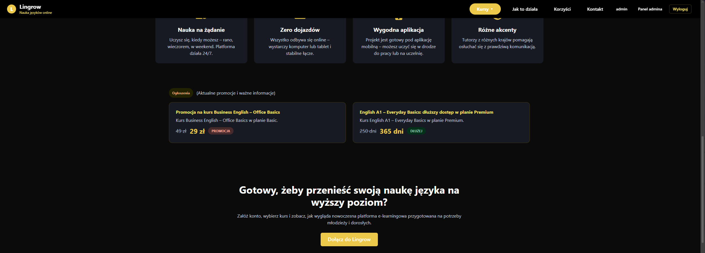
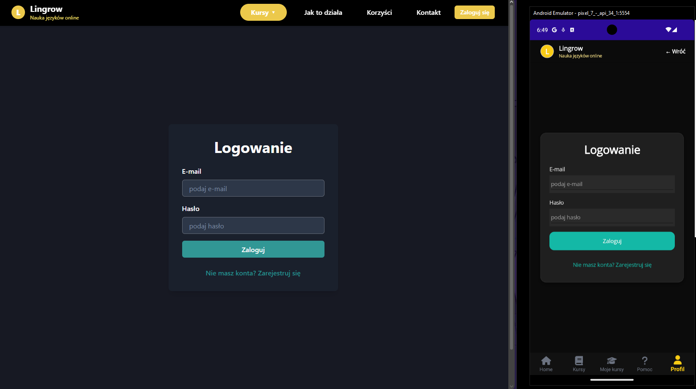
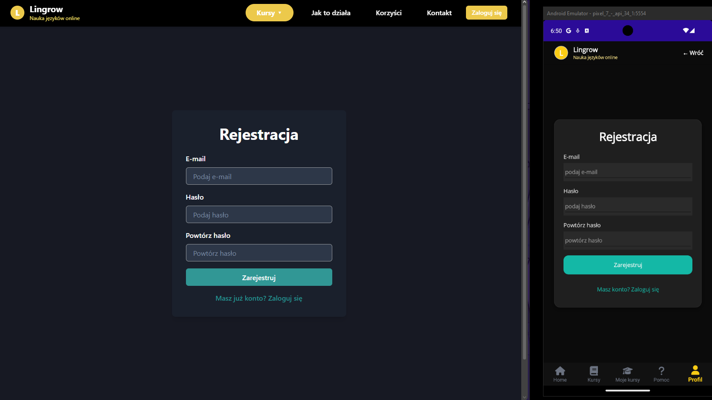
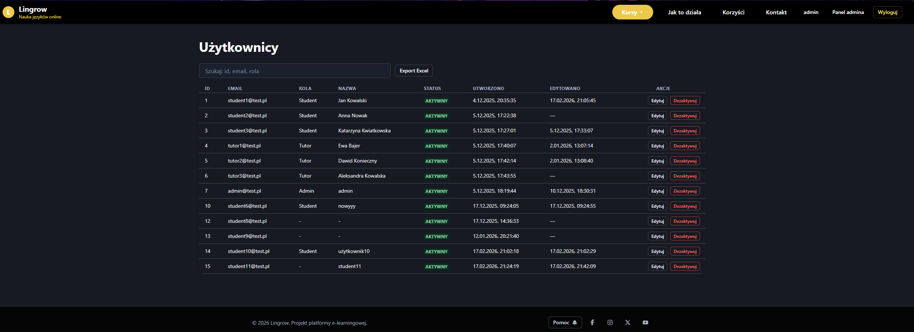
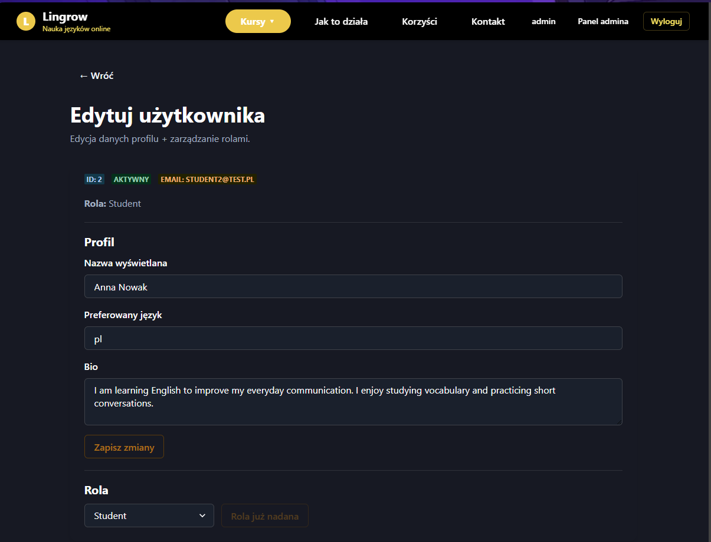
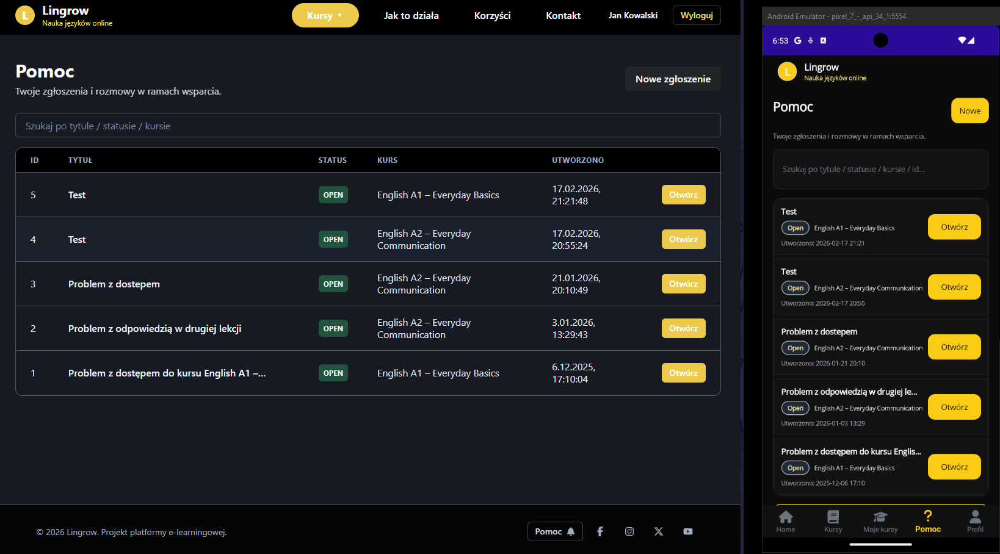

# 🎓 E-Learning Platform

## 💡 Project Overview

This project is a full-stack e-learning platform designed to support online learning through structured courses, lessons, and quizzes.

The system follows a client-server architecture. The backend is built with ASP.NET Core Web API and handles business logic, authentication, and data management using SQL Server (Database First approach).

The frontend is implemented in React, while a mobile application was developed using .NET MAUI. Both clients communicate with the backend via REST API.

## 🚀 Features

- JWT authentication
- Role-based access control
- Courses, modules, and lessons
- Quiz system with scoring and attempts
- Progress tracking
- Certificate generation
- CMS (dynamic content)
- Support tickets and notifications

## 🧱 Tech Stack

- ASP.NET Core
- Entity Framework Core
- SQL Server
- React
- .NET MAUI
- FluentValidation
- JWT

## 📸 Screenshots

### Home page


### Home page 2



### Course list


### Lesson view


### Quiz


### Login



### Register



### Admin panel


### Admin panel 2



### Admin panel 3



### Support ticket



## ⚙️ How to run

### Database

- Open `database/schema.sql` in SQL Server Management Studio
- Run the script (F5)

### Backend

- Open solution in Visual Studio
- Configure connection string in `appsettings.json`
- Run API

### Frontend

- Navigate to `frontend` folder
- Run:

```bash
npm install
npm run dev
```

## 📖 Setup

For detailed setup instructions, see [SETUP.md](SETUP.md)

## 🏗️ Project Structure

- `backend/` – ASP.NET Core Web API
- `frontend/` – React application
- `mobile/` – .NET MAUI application
