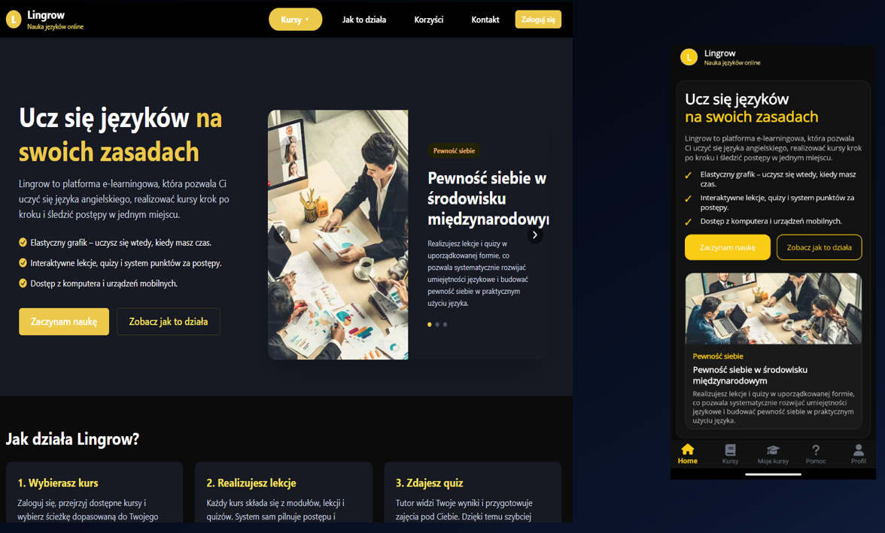
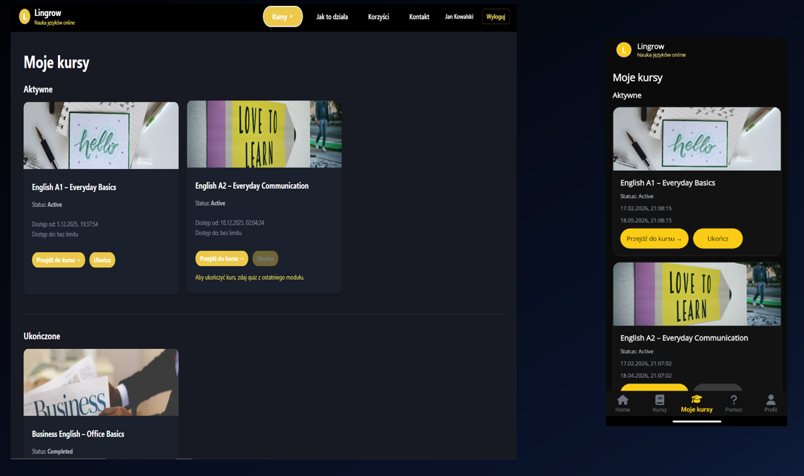
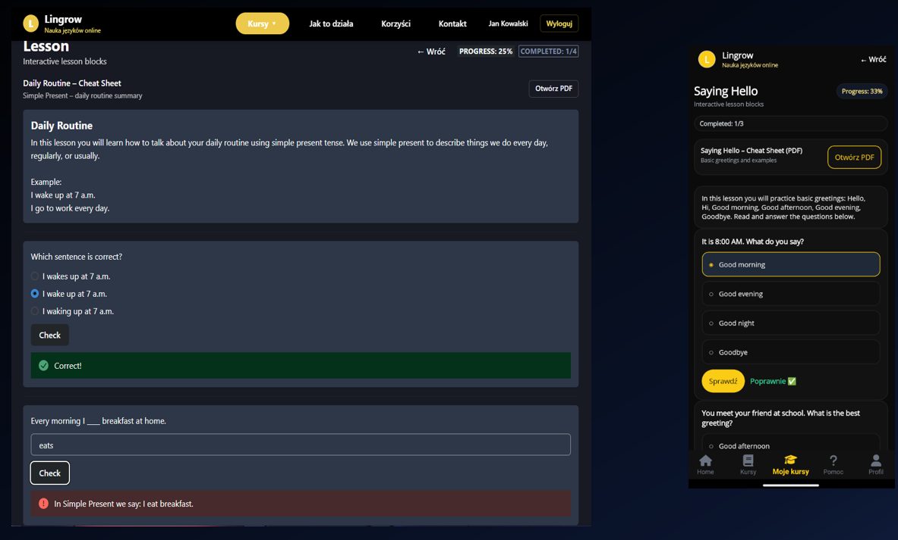
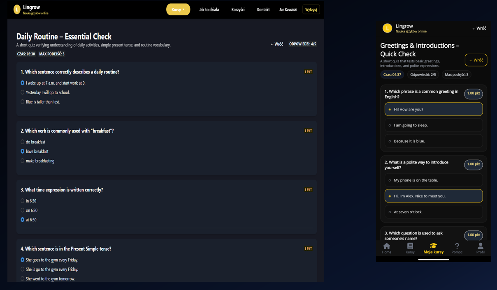
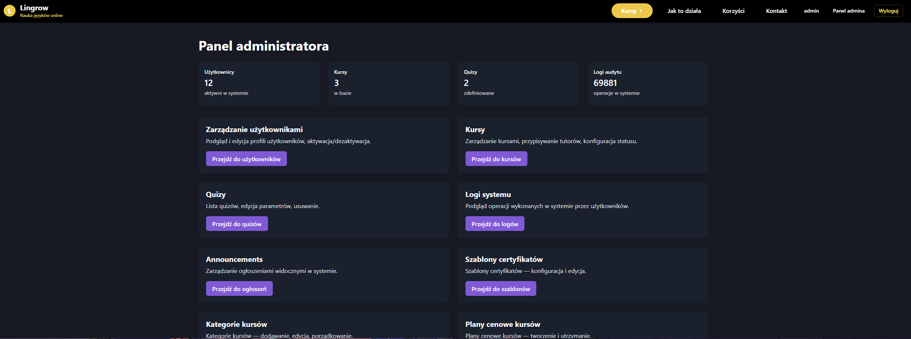

# 🎓 E-Learning Platform

Full-stack e-learning system built with ASP.NET Core, React, and .NET MAUI.

## 🚀 Features

- JWT authentication
- Role-based access control
- Courses, modules, and lessons
- Quiz system with scoring and attempts
- Progress tracking
- Certificate generation
- CMS (dynamic content)
- Support tickets and notifications

## 🧱 Tech Stack

- ASP.NET Core
- Entity Framework Core
- SQL Server
- React
- .NET MAUI
- FluentValidation
- JWT

## 📸 Screenshots

### Home page


### Course list


### Lesson view


### Quiz


### Admin panel


## ⚙️ How to run

### Backend
- Open solution in Visual Studio
- Configure connection string in `appsettings.json`
- Run API

### Frontend
- Navigate to `frontend` folder
- Run:

```bash
npm install
npm run dev
```

## 🏗️ Project Structure

- `backend/` – ASP.NET Core Web API
- `frontend/` – React application
- `mobile/` – .NET MAUI application

## 📌 About

This project was created as part of an engineering thesis and demonstrates full-stack application development.

